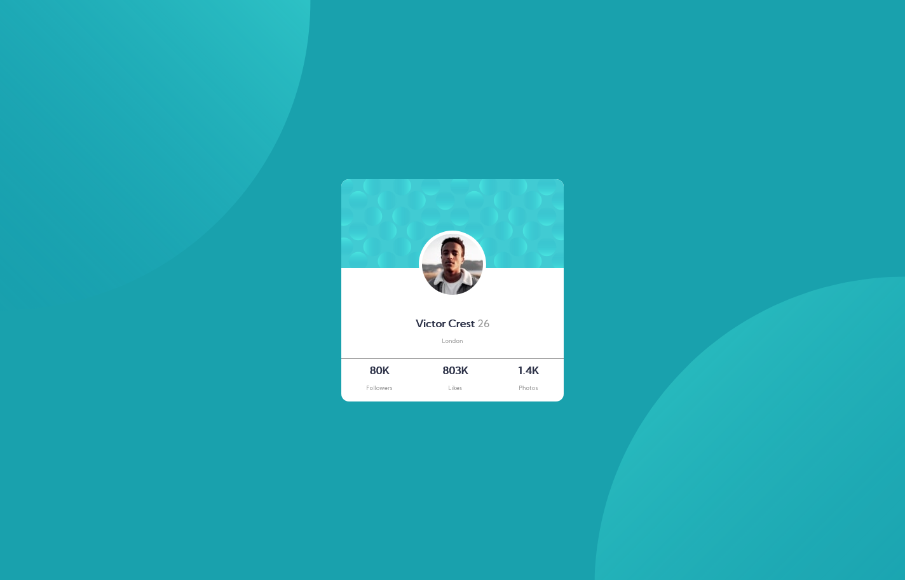

# Frontend Mentor - Profile card component solution

This is a solution to the [Profile card component challenge on Frontend Mentor](https://www.frontendmentor.io/challenges/profile-card-component-cfArpWshJ). Frontend Mentor challenges help you improve your coding skills by building realistic projects. 

## Table of contents

- [Overview](#overview)
  - [The challenge](#the-challenge)
  - [Screenshot](#screenshot)
  - [Links](#links)
- [My process](#my-process)
  - [Built with](#built-with)
  - [What I learned](#what-i-learned)
  - [Continued development](#continued-development)
  - [Useful resources](#useful-resources)
- [Author](#author)
- [Acknowledgments](#acknowledgments)

## Overview

### The challenge

- Build out the project to the designs provided

### Screenshot

### Links

- Solution URL: [Add solution URL here](https://your-solution-url.com)
- Live Site URL: [Add live site URL here](https://your-live-site-url.com)

## My process

### Built with

- Semantic HTML5 markup
- CSS properties
- Flexbox

### What I learned

Good training

### Continued development

Background position is something I need to practice more in the future, especially how to work with ellipse and different screen size

### Useful resources

- [resource css units](https://www.w3schools.com/cssref/css_units.asp) - This helped me to create a better placement.

## Author

- Github - [@MrDanilka](https://github.com/MrDanilka)
- Frontend Mentor - [@MrDaniel-git](https://www.frontendmentor.io/profile/MrDaniel-git)

